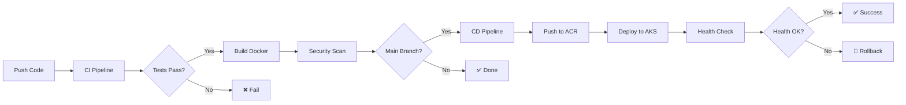

# 🚀 GitHub Actions CI/CD Pipeline - Setup

Este guia explica como configurar a pipeline completa de CI/CD para deploy automático no Azure Kubernetes Service (AKS).

## 📁 **Arquivos da Pipeline**

A pipeline foi dividida em 3 workflows principais:

### 1. **`.github/workflows/ci.yml`** - Continuous Integration
- ✅ Build da aplicação .NET 8
- ✅ Execução de testes automatizados
- ✅ Análise de qualidade de código
- ✅ Scan de segurança com Trivy
- ✅ Upload de coverage para Codecov

### 2. **`.github/workflows/cd-aks.yml`** - Continuous Deployment
- ✅ Build e push da imagem Docker para ACR
- ✅ Deploy automático no AKS
- ✅ Health checks pós-deploy
- ✅ Rollback automático em caso de falha
- ✅ Testes de API

### 3. **`.github/workflows/pr-checks.yml`** - Pull Request Validation
- ✅ Validação de PRs
- ✅ Build test do Docker
- ✅ Comentários automáticos no PR
- ✅ Lista de arquivos alterados

## 🔐 **Configuração dos Secrets**

Para a pipeline funcionar, você precisa configurar os seguintes secrets no GitHub:

### **1. AZURE_CREDENTIALS**
Service Principal com permissões para AKS e ACR.

```bash
# 1. Criar Service Principal
az ad sp create-for-rbac --name "escola-qapabilities-github" \
  --role contributor \
  --scopes /subscriptions/{subscription-id}/resourceGroups/escola-qapabilities-rg \
  --sdk-auth

# 2. O resultado será algo como:
{
  "clientId": "xxxxxxxx-xxxx-xxxx-xxxx-xxxxxxxxxxxx",
  "clientSecret": "xxxxxxxxxxxxxxxxxxxxxxxxxxxxxxxx",
  "subscriptionId": "xxxxxxxx-xxxx-xxxx-xxxx-xxxxxxxxxxxx",
  "tenantId": "xxxxxxxx-xxxx-xxxx-xxxx-xxxxxxxxxxxx",
  "activeDirectoryEndpointUrl": "https://login.microsoftonline.com",
  "resourceManagerEndpointUrl": "https://management.azure.com/",
  "activeDirectoryGraphResourceId": "https://graph.windows.net/",
  "sqlManagementEndpointUrl": "https://management.core.windows.net:8443/",
  "galleryEndpointUrl": "https://gallery.azure.com/",
  "managementEndpointUrl": "https://management.core.windows.net/"
}

# 3. Copie TODO o JSON e cole no secret AZURE_CREDENTIALS
```

### **2. Configurar no GitHub**

1. **Acesse seu repositório no GitHub**
2. **Vá em Settings → Secrets and variables → Actions**
3. **Clique em "New repository secret"**
4. **Adicione os secrets:**

| Name | Value | Descrição |
|------|-------|-----------|
| `AZURE_CREDENTIALS` | JSON completo do Service Principal | Credenciais para Azure |

## 🏗️ **Como Usar a Pipeline**

### **Triggers Automáticos:**

#### **CI (Continuous Integration)**
- ✅ **Push** em qualquer branch (`main`, `develop`, `feature/*`)
- ✅ **Pull Request** para `main` ou `develop`

#### **CD (Continuous Deployment)**
- ✅ **Push** para branch `main` (production deploy)
- ✅ **Manual trigger** via GitHub Actions UI

#### **PR Checks**
- ✅ **Pull Request** aberto/atualizado

### **Deploy Manual:**

1. **Vá em Actions no GitHub**
2. **Selecione "CD - Deploy para AKS"**
3. **Clique em "Run workflow"**
4. **Escolha o ambiente (production/staging)**
5. **Clique em "Run workflow"**

## 🎯 **Fluxo Completo**



## 📊 **Monitoramento**

A pipeline fornece:

- ✅ **Status badges** para README
- ✅ **Notificações** de sucesso/falha
- ✅ **Logs detalhados** de cada step
- ✅ **Health checks** automáticos
- ✅ **Rollback** em caso de falha

## 🛠️ **Troubleshooting**

### **Erro: Azure Login Failed**
```bash
# Verificar se o Service Principal está correto
az login --service-principal \
  -u $CLIENT_ID \
  -p $CLIENT_SECRET \
  --tenant $TENANT_ID
```

### **Erro: ACR Access Denied**
```bash
# Dar permissão ao Service Principal para o ACR
az role assignment create \
  --assignee $CLIENT_ID \
  --role AcrPush \
  --scope /subscriptions/$SUBSCRIPTION_ID/resourceGroups/escola-qapabilities-rg/providers/Microsoft.ContainerRegistry/registries/escolaaksregistry
```

### **Erro: AKS Access Denied**
```bash
# Dar permissão ao Service Principal para o AKS
az role assignment create \
  --assignee $CLIENT_ID \
  --role "Azure Kubernetes Service Cluster User Role" \
  --scope /subscriptions/$SUBSCRIPTION_ID/resourceGroups/escola-qapabilities-rg/providers/Microsoft.ContainerService/managedClusters/escola-aks
```

## 🔄 **Próximos Passos**

1. ✅ **Configure os secrets no GitHub**
2. ✅ **Faça um commit para testar a CI**
3. ✅ **Faça um push para main para testar a CD**
4. ✅ **Monitore os logs no GitHub Actions**

**🎉 Com isso, você terá uma pipeline completa de CI/CD funcionando!**
